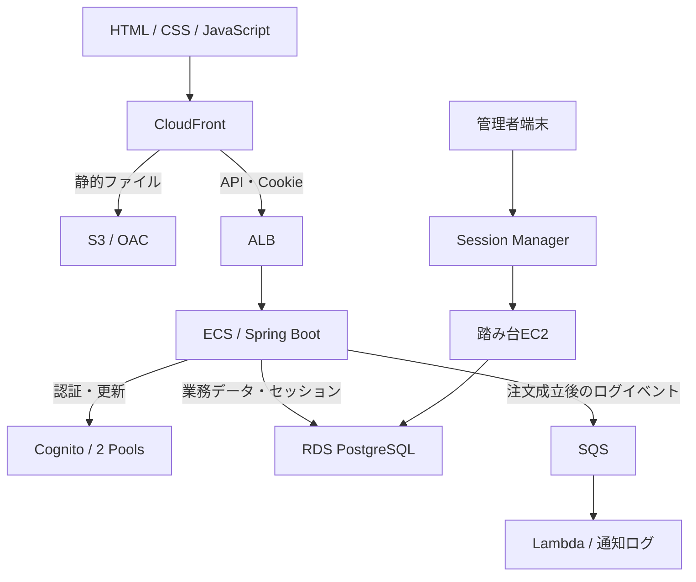

# AWS設計書 — cloudnative-ec-java

版：0.1 / 作成日：2026-10-06 / 状態：IaC実装前の設計ドラフト

## 目的と管理方法

AWS CDK v2（Java）で構築するための設定・依存関係・責務・検証条件を定義する。実装済み・デプロイ済みを示す資料ではない。設定表の「案」は未承認の推奨初期値であり、確定事項と区別する。

既存リポジトリの `docs/`、`ecs/`、`frontend/`、`iac/` を維持する。本一式は `docs/aws/` に配置する。CDKコードは `iac/`、Spring Bootは `ecs/`、HTML・CSS・JavaScriptは `frontend/` に配置する。設計書とコードは同じPRで更新する。

## 文書一覧

| 文書 | 対象 |
|---|---|
| [01-network.md](01-network.md) | VPC・サブネット・ルート・SG・SSM |
| [02-compute.md](02-compute.md) | ECS・ALB・ECR・踏み台EC2 |
| [03-data-storage.md](03-data-storage.md) | RDS・S3・バックアップ |
| [04-auth-security.md](04-auth-security.md) | Cognito・Cookie・IAM・秘密情報 |
| [05-delivery.md](05-delivery.md) | DNS・証明書・CloudFront・静的ページ |
| [06-operations.md](06-operations.md) | SQS・Lambda・監視・停止・復旧 |
| [07-iac.md](07-iac.md) | CDKの構成・変数・デプロイ順序 |

## 確定事項

- フロントエンド：HTML・CSS・JavaScript。React・TypeScriptは使用しない。
- バックエンド：Java / Spring Boot。AWS CDKもJavaで記述するが、別プロジェクトとする。
- 認証：独自画面 → バックエンド → Cognito。ユーザー用と管理者用のUser Poolを分離。
- 会員のメール確認：Cognito標準メール・標準文面。確認完了後はログイン画面へ戻り、自動ログインしない。
- 会員セッション：ログインから最大12時間。操作による延長なし。PostgreSQLで保存し、Cookieにはセッション識別子を保持。
- RDSはプライベート配置。DB管理はEC2踏み台を使用。Route 53・ACMを採用。
- ゲストカート：最後の正常な更新から7日。参照では延長しない。会員のログアウトで会員カートを削除しない。
- 決済・カード保存はモック。実際の決済・請求・発送・購入完了メール送信なし。
- 注文受付→手配中を含む注文状況変更は管理者操作。SQSによる自動更新なし。

## 基本構成案

小規模検証環境1つを想定。東京リージョン、ECS Fargate 1タスク、RDS Single-AZを初期案とする。ECS・EC2はPublic subnetに置き、受信をSGで制限する。RDSはPrivate isolated subnetに置く。NAT Gatewayは初期案に含めない。可用性を保証する本番構成ではない。

DNSはRoute 53、TLS証明書はACM。ログ・メトリクスはCloudWatch。図は主要経路を示し、応答・IAM・証明書の関連付け等は省略している。

## IaCとアプリケーションの境界

| IaCが管理 | アプリ・運用が管理 |
|---|---|
| VPC・SG・RDS本体・バックアップ設定 | DBスキーマのマイグレーション、税計算、在庫ロック |
| Cognito Pool / App Client / Group | ログイン、Cookie、CSRF、12時間絶対期限、カート統合 |
| SQS / DLQ / Lambda / IAM | イベントの内容・重複処理防止、通知ログ処理 |
| ECS / ALB / CloudFront / S3 | アプリイメージ・静的ファイルのリリース |
| 管理者Pool・権限設定の枠 | 初期管理者1名の作成とパスワード設定 |

## 実装前の確認事項

| 項目 | 初期案・確認内容 | 状態 |
|---|---|---|
| AWSアカウント・環境名 | 個人の検証環境 `dev` 1つ | 未確定 |
| ドメイン・Hosted Zone | 取得済みか、新規購入か。ドメイン名を確定 | 未確定 |
| リージョン | 主系ap-northeast-1、配信用ACM us-east-1 | 案 |
| CIDR・AZ | 01-networkの表。既存ネットワークと重複しないこと | 案 |
| ECS・DB容量 | 02/03の初期サイズ。負荷確認後に調整 | 案 |
| 管理者セッション期限 | 会員とは別設定。初期案1時間、管理者1名 | 未確定 |
| 稼働時間・月額上限 | 常時か検証時のみか、通知先と予算額 | 未確定 |
| 管理者MFA | 初期導入の有無。設計・画面追加への影響を確認 | 未確定 |
| Java・CDK・PostgreSQLバージョン | 実装時の対応状況を確認して具体バージョン固定 | 未確定 |
| イベント送信の再送保証 | 06-operationsの通知ログ許容範囲を確認 | 案 |

## 更新履歴

| 日付 | 版 | 変更 |
|---|---|---|
| 2026-10-06 | 0.1 | CDK Java、HTML/CSS/JavaScript、Cookie＋PostgreSQLセッションに合わせて初版作成 |
