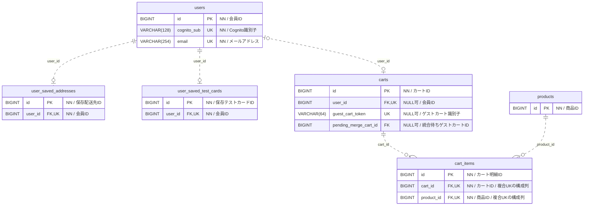
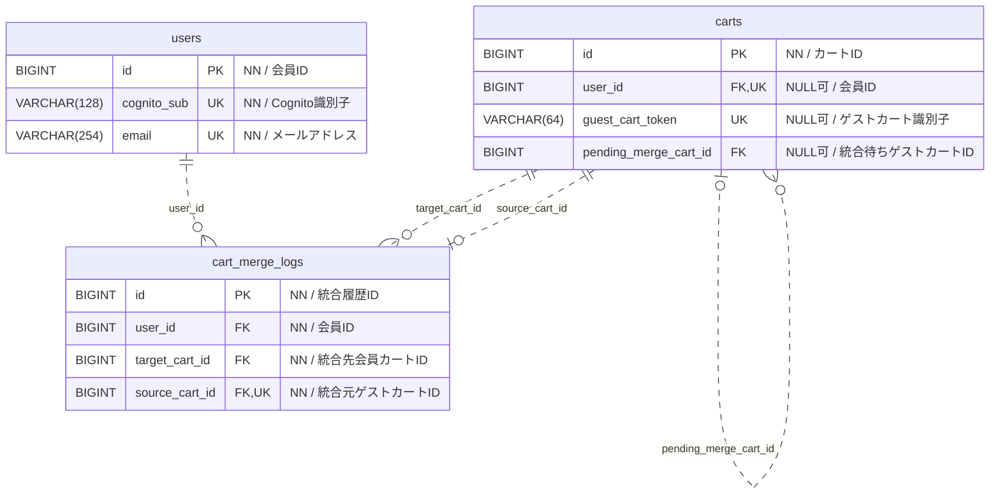
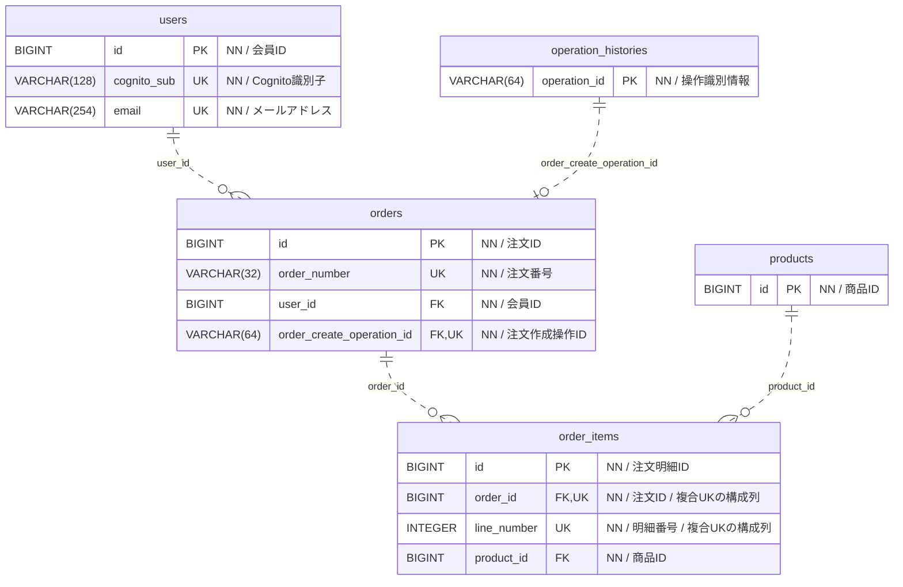
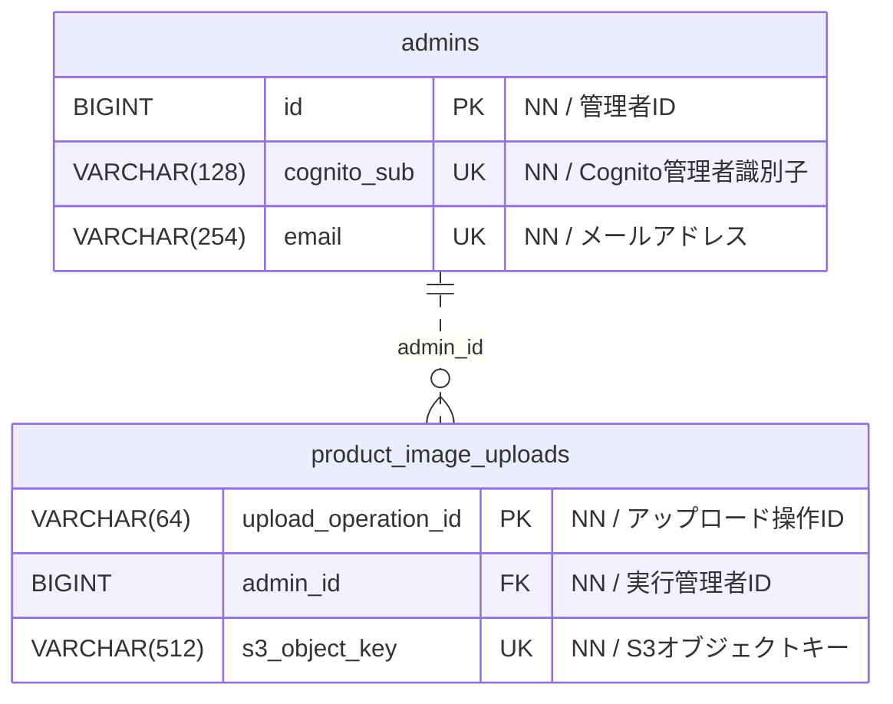
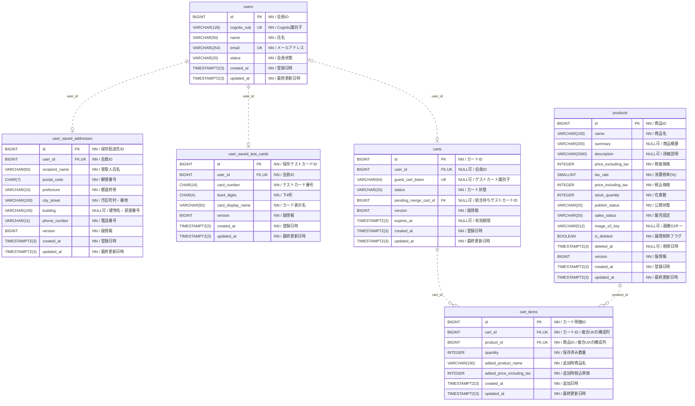
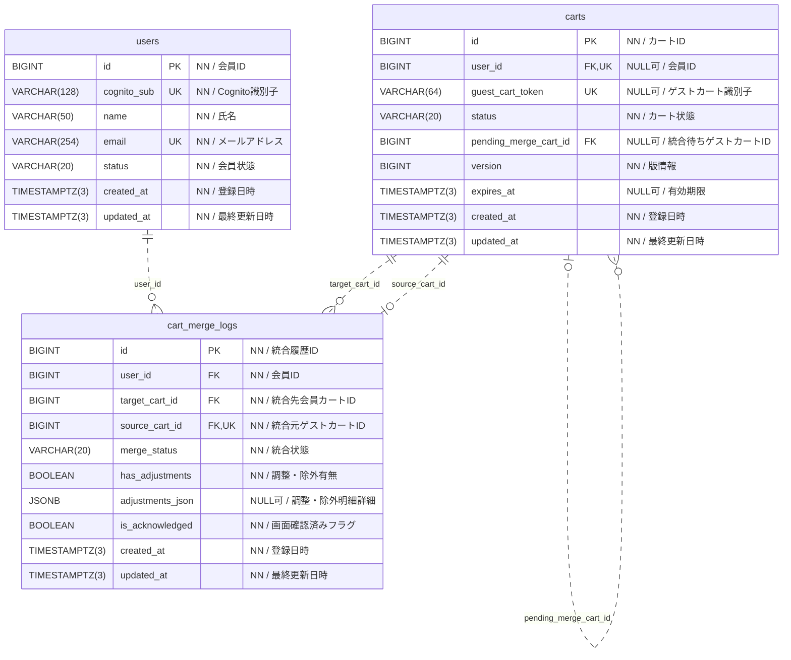
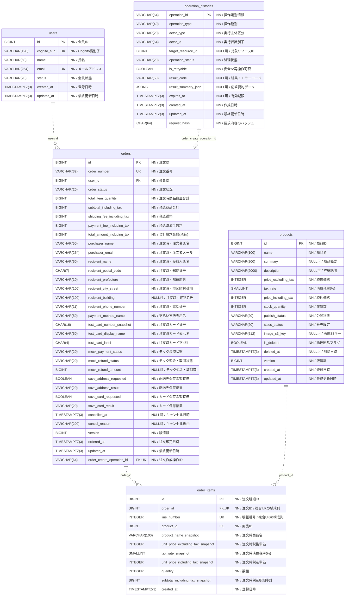
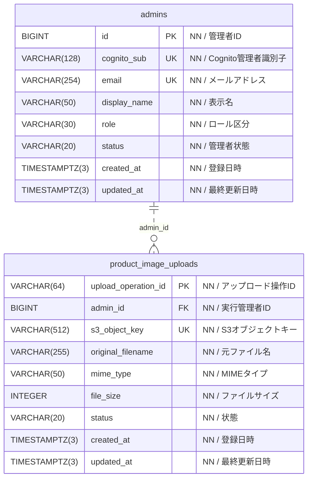

# ECサイト ER図

作成日：2026-10-05。更新済みDB設計書の12テーブル・144カラム・14外部キーを基に作成。

元資料：[DB設計書](https://docs.google.com/spreadsheets/d/1Z0vjYRgUz5CAtnzGMfQ3tNxWlo-Geof-nJeexnSFCLI/edit)

## 図の読み方

- PK：主キー、FK：外部キー、UK：一意制約、NN：NOT NULL。
- `||` は必ず1件、`o|` は0または1件、`o{` は0件以上。線端はその側の件数を示す。
- 点線は非識別関係（親キーが子の主キーに含まれないFK）。アプリ側参照を意味しない。
- 多重度はDBのFK・NULL・UNIQUE制約に基づく。成立済み注文は業務上1明細以上必須だが、FKのみでは最低1件を保証できないため図では0件以上とする。
- 分割図に同じテーブルが再登場する。DB上で重複作成する意味ではない。
- 複合UKは構成列単体の一意性を意味しない。cart_itemsは(cart_id, product_id)、order_itemsは(order_id, line_number)。

## 主要な補足

- carts.user_idとguest_cart_tokenは片方のみ設定。会員は0〜1カート、ゲストカートには会員参照がない。
- 保存配送先・保存テストカードは会員ごとに最大1件。テスト番号は全16桁を保持し、取得APIの表示項目はID・表示名・下4桁のみ。
- carts.pending_merge_cart_idは任意の自己参照。DB上は複数の参照元が同じカートを指せる。参照先がゲストであること・所有権はバックエンドで検証。
- cart_merge_logs.source_cart_idは単独UNIQUE。同一ゲストカートの再試行は同じ統合履歴を更新。
- orders.order_create_operation_idは必須FKかつUNIQUE。1操作につき注文は0〜1件。注文を持つ操作履歴は削除しない。
- 注文時の商品名・価格・税率・配送先・カード情報はスナップショット。保存配送先・保存カードへのFKは設けない。
- 注文画像はorder_items.product_idから現在の商品画像を参照する。商品は論理削除し、注文記録とのFKを維持。
- 日時はTIMESTAMPTZ(3)でUTC保持、画面でJST表示。合計・小計・返金額はBIGINT。

## 外部キーを持たない参照

| 項目 | 参照・照合先 | 扱い |
| --- | --- | --- |
| users.cognito_sub | 一般会員用Cognitoプール | 外部サービスの識別子。DBのFKではない。 |
| admins.cognito_sub | 管理者用Cognitoプール | 外部サービスの識別子。DBのFKではない。 |
| operation_histories.actor_type / actor_id | USER: users.id、ADMIN: admins.id、GUEST: carts.id | 種別に応じてバックエンドで照合。FK線は描かない。 |
| operation_histories.target_resource_id | 注文・商品等 | 操作種別に応じた参照。FK線は描かない。 |
| products.image_s3_key | S3オブジェクト、アップロード管理情報 | 現行DB設計にproduct_image_uploadsへのFKはない。 |

## 会員・保存情報・カート（キー項目）

## カート統合（キー項目）

## 注文・注文時点の記録（キー項目）

## 管理者・画像アップロード（キー項目）

## 全カラム版

分割図の以下のコードをMermaid対応エディタへ貼り付けると編集できます。

### 会員・保存情報・カート

### カート統合

### 注文・注文時点の記録

### 管理者・画像アップロード

## 後続設計で確定する事項

ゲスト期限7日の起点、税の端数処理、在庫引当の同期／非同期方式、モック決済の詳細状態、Cookieセッションの保存先は元資料の確認事項に従う。未確定のテーブル・FKは本図へ追加していない。
